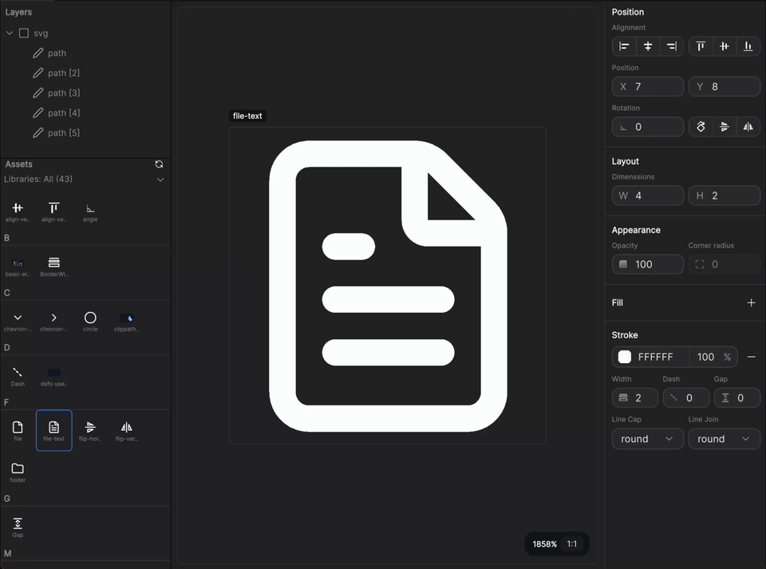
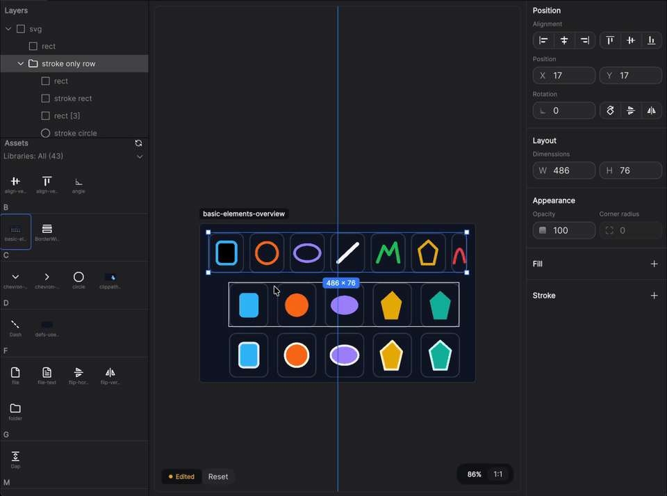
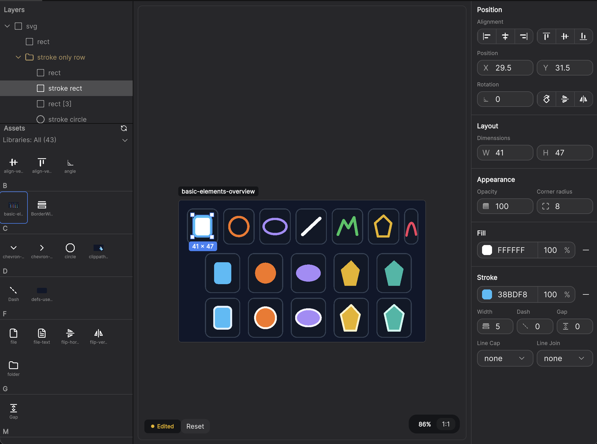
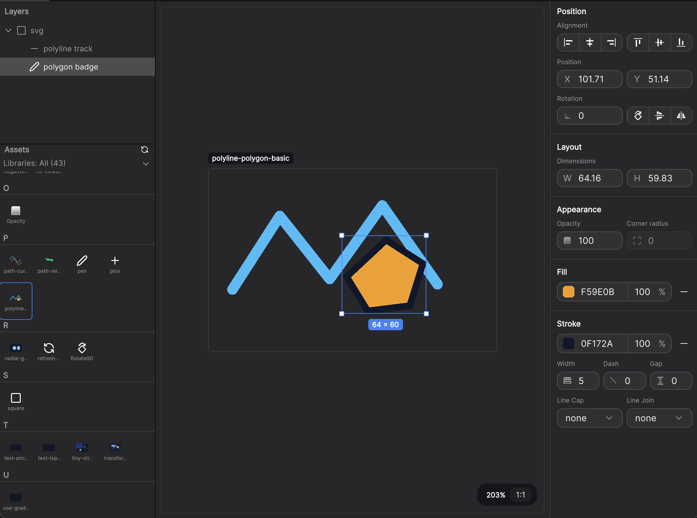
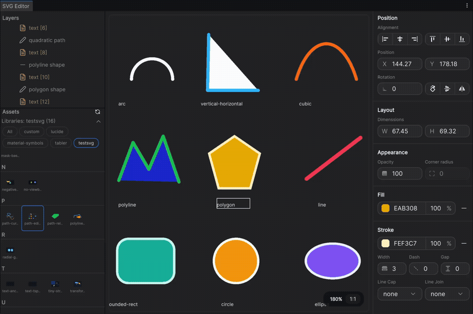
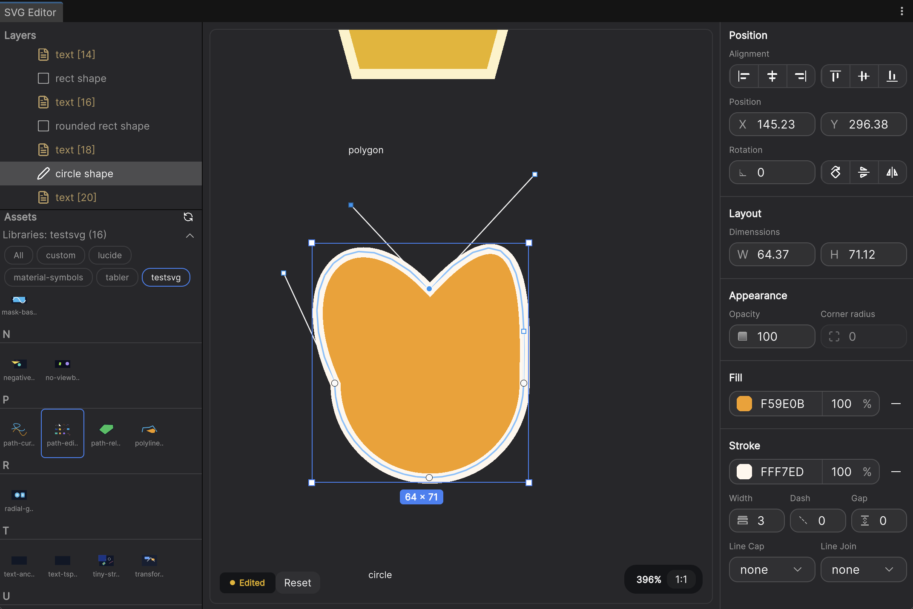

# Unity SVG Editor

Inspect SVG assets, edit supported properties and path anchors directly in Unity, and save changes back to SVG.


`Unity SVG Editor` is an editor package for teams that need to inspect existing SVG files, edit supported shapes visually, adjust path anchors and handles on canvas, and write the result back to SVG XML.

- Package name: `com.maemi.unity-svg-editor`
- Namespace: `SvgEditor.Editor`
- Menu: `Window/Tools/SVG Editor`

## Highlights

- Inspect SVG hierarchy and preview imported geometry inside the Unity Editor
- Select, move, resize, and rotate supported elements directly on the canvas
- Enter path edit mode to adjust anchors and handles for supported shapes
- Save changes back to SVG source and trigger immediate reimport
- Surface unsupported SVG features and importer fallback states instead of hiding them

## Demo

| Demo 1 | Demo 2 |
|:--:|:--:|
|  |  |

| Screenshot 1 | Screenshot 2 |
|:--:|:--:|
|  |  |

### Path Edit

| Path Edit Demo | Path Edit Screenshot |
|:--:|:--:|
|  |  |

### Usage Videos

- Usage video link 1: https://youtu.be/PBwFVrmF7D8
- Usage video link 2: https://youtu.be/NTcLOPhuFL0

Replace these placeholders when you send the final public video URLs.

## Installation

### Option 1: Git URL

1. Open `Window > Package Manager`
2. Click `+`
3. Select `Add package from git URL...`
4. Enter:

```text
https://github.com/NewMassMedia/unity-svg-editor.git
```

### Option 2: Local package

1. Clone or download this repository
2. Open `Window > Package Manager`
3. Click `+`
4. Select `Add package from disk...`
5. Choose `package.json`

## Quick Start

Open `Window > Tools > SVG Editor`, then:

1. Select an SVG asset from the project browser inside the tool
2. Review the structure tree and current preview
3. Select elements on the canvas or in the tree
4. Adjust properties in the inspector or enter path edit mode for supported shapes
5. Save and let Unity reimport the asset immediately
6. Review warnings if the document contains unsupported features or fallback rendering cases

## What You Can Do

### Structure And Selection

- Browse SVG `VectorImage` assets inside the project
- Inspect SVG document structure with selection sync
- Select elements on canvas, in the hierarchy, or by marquee

### Transform Editing

- Move, resize, and rotate supported elements on the canvas
- Use snapping, axis locking, center resize, and keyboard nudging
- Commit edits back to SVG source with undo / redo support

### Path Editing

- Double-click supported shapes to enter path edit mode
- Select anchors and handles directly on the canvas
- Drag anchors and handles and commit the result back to SVG
- Edit relative and curved path commands including `C`, `S`, `Q`, and `T`

## Supported Elements

Current support is strongest in preview, structure inspection, transform editing, and path editing for common SVG primitives.

Editable and previewed elements include:

- `rect`
- `circle`
- `ellipse`
- `line`
- `polyline`
- `polygon`
- `path`
- `use`
- `linearGradient`
- `radialGradient`
- `clipPath`
- basic `mask`
- `text`

Path edit mode currently supports:

- `path`
- `line`
- `rect`
- `circle`
- `ellipse`
- `polyline`
- `polygon`

### Interaction Guide

The editor supports a small set of focused canvas and keyboard interactions. The list below documents the controls that are currently implemented.

#### Selection

| Action | Control | Notes |
|:--|:--|:--|
| Select element on canvas | `Click` | On canvas, plain click prefers a containing group when one is under the pointer. |
| Select direct leaf element | `Ctrl/Cmd + Click` | Bypasses group selection and targets the directly hit element. |
| Toggle canvas selection | `Shift + Click` | Adds or removes the clicked canvas element from the current selection. |
| Add with marquee selection | `Shift + Drag` on empty canvas | Adds overlapped elements to the current selection. |
| Replace with marquee selection | `Drag` on empty canvas | Replaces the current selection with the marquee result. |
| Select in hierarchy | `Click` | Selects a single row. |
| Toggle in hierarchy | `Ctrl/Cmd + Click` | Adds or removes the clicked hierarchy row. |
| Range select in hierarchy | `Shift + Click` | Selects a range from the current anchor row. |

#### Transform Editing

| Action | Control | Notes |
|:--|:--|:--|
| Move selection | `Drag selection` | Drag the selected element or multi-selection bounds. |
| Nudge selection | `Arrow Keys` | Moves the current element selection by `1` unit per key press. |
| Large nudge | `Shift + Arrow Keys` | Moves the current element selection by `10` units. |
| Constrain move axis | `Shift + Drag` | Locks movement to a dominant axis while dragging. |
| Snap move | `Ctrl/Cmd + Drag` | Enables move snapping while dragging. |
| Uniform resize | `Shift + Drag resize handle` | Keeps proportional scaling during resize. |
| Resize from center | `Alt + Drag resize handle` | Resizes symmetrically from the center. |
| Snap resize | `Ctrl/Cmd + Drag resize handle` | Enables resize snapping while dragging. |
| Snap rotation | `Shift + Drag rotate handle` | Enables snapped rotation while rotating. |
| Cancel active drag | `Esc` | Cancels the current drag preview. |

#### Path Edit Mode

| Action | Control | Notes |
|:--|:--|:--|
| Enter path edit | `Double Click` on an editable shape | Supported for `path`, `line`, `rect`, `circle`, `ellipse`, `polyline`, and `polygon` when editable path data can be built. |
| Enter path edit on direct leaf | `Ctrl/Cmd + Double Click` | Useful when a group would otherwise be selected first. |
| Select path node or handle | `Click` | Selects the clicked node or handle inside path edit mode. |
| Clear path node/handle selection | `Click` empty space in path edit mode | Clears the active path sub-selection. |
| Move path node or handle | `Drag` | Commits back to SVG source when the drag completes successfully. |
| Exit path edit | `Esc` | Exits path edit mode when no path drag is active. |
| Cancel active path drag | `Esc` during path drag | Restores the path edit session to its pre-drag state. |

Path edit is not entered when the target shape cannot be converted to editable path data, or when the path contains unsupported or malformed commands. In those cases the editor stays in read-only preview mode and shows a status message.

#### Document Shortcuts

| Action | Control | Notes |
|:--|:--|:--|
| Save | `Ctrl/Cmd + S` | Saves the current SVG and triggers reimport. |
| Undo | `Ctrl/Cmd + Z` | Reverts the last document edit. |
| Redo | `Ctrl/Cmd + Shift + Z` | Reapplies the last undone edit. |
| Delete selection | `Delete` or `Backspace` | Deletes selected elements when a text field is not being edited. |

## Limits

These areas are intentionally unsupported or currently limited:

- Full SVG authoring parity with Illustrator, Figma, or other vector design tools
- Full XML source editing or code-inspector style workflows
- direct gradient editing
- `filter`
- `image`
- `style`
- direct `textPath` editing
- per-`tspan` detailed editing
- advanced SVG cases that do not map cleanly to Unity `VectorImage`

Limited support:

- `text` and `tspan`
  - overlay preview and basic selection work, but detailed text authoring is limited
- `textPath`
  - preview may import, but it is not a direct editing target
- `linearGradient` and `radialGradient`
  - preview and import behavior may work, but direct gradient editing is not supported yet
- combined advanced cases such as `use + gradient + clipPath`
  - preview can work, but editing precision still depends on Unity import behavior

## What Depends On Unity

This package follows Unity's SVG and `VectorImage` boundaries instead of inventing a separate rendering standard.

In practice, that means:

- Best results come from shapes, paths, gradients, clip paths, and common transforms supported by Unity's SVG importer
- Some SVG features may import with partial rendering, fallback rendering, or no direct editing target
- `text` in this package should be treated as an editor-assisted overlay workflow, not as native Unity `VectorImage` text authoring support
- If Unity falls back internally, the editor exposes that state rather than pretending the feature is fully supported

## Requirements

- Unity `6000.0` or later
- SVG import pipeline available in the Unity project

## Versioning

This project is intended to follow Semantic Versioning.

- `1.0.0`: first stable public release
- `1.0.1`: patch release for fixes only
- `1.1.0`: backward-compatible feature release
- `2.0.0`: breaking changes

Current package version: `1.1.0`

## Release History

Release notes should be tracked in [CHANGELOG.md](CHANGELOG.md).

Recommended structure:

- `Unreleased`
- `1.0.0 - YYYY-MM-DD`
- `1.0.1 - YYYY-MM-DD`

## Release Process

For each public release:

1. Update `package.json` version
2. Update `CHANGELOG.md`
3. Prepare the demo GIF, screenshots, and usage video link
4. Commit the release metadata
5. Create a git tag
6. Publish a GitHub release from that tag

Recommended release commit message:

```text
chore(release): v1.1.0
```

Recommended tag format:

```bash
git tag v1.1.0
git push origin v1.1.0
```

Recommended GitHub release title:

```text
Unity SVG Editor v1.1.0
```

## License

MIT
